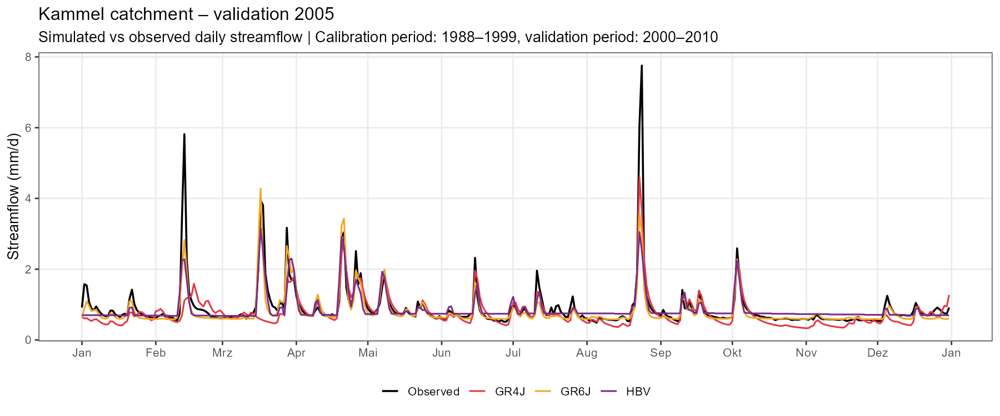
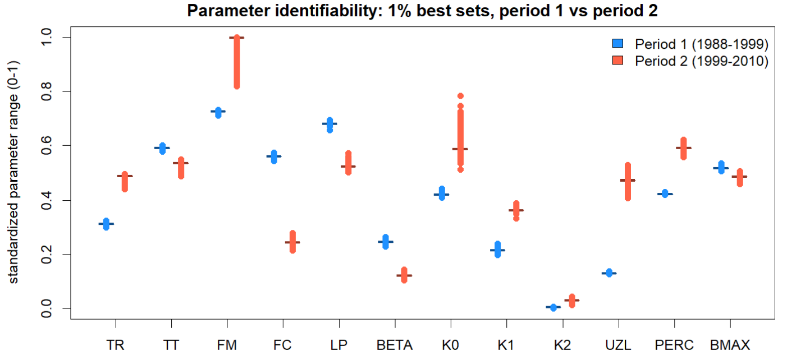
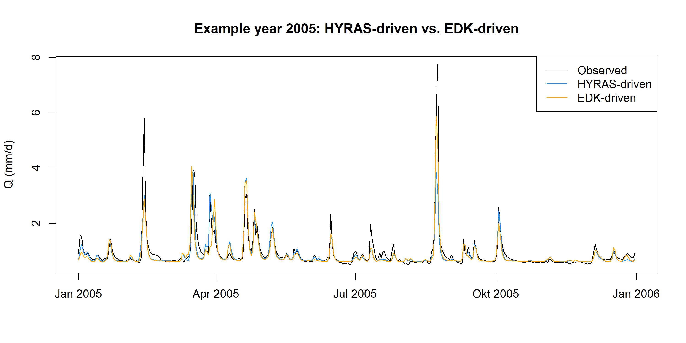
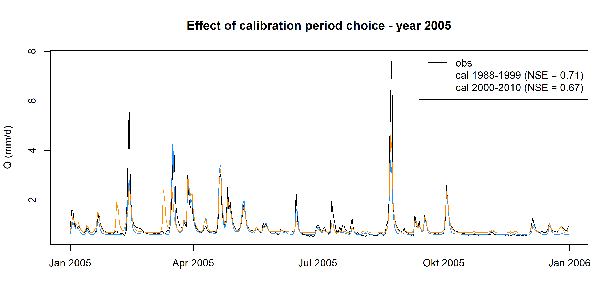

<!--
QUARTO NOTES
- Render with:  quarto render report.qmd --to pdf
- If PDF rendering fails due to missing LaTeX: quarto install tinytex
  (or switch the format above to `typst` for a LaTeX-free PDF)
- Images: put all figures in a ./figures folder and reference with
  {#fig-label width="80%"}
  then refer to it in text as @fig-label
- Remove the `bibliography`/`csl` lines if you don't end up using .bib citations
-->

\newpage

# Contributions {.unnumbered}

<!-- Required: detailed, paper-style contribution statement.
     Table works well, e.g.: -->

| Group member | Contributions |
|---|---|
| Lukas Fuchs | GR6J runs, catchment descriptors, data uncertainty (EDK), calibration-period uncertainty, structural uncertainty, discussion |
| Niklas Carniel | HBV runs, catchment descriptors, parameter uncertainty, discussion |
| Humza Asrar Ahmed | GR4J runs, counterfactual analysis |

# Use of AI Tools {.unnumbered}

Generative AI tools (Claude, Anthropic) were used throughout this project to support the group's work. Specific uses included:

- Assistance with writing and debugging R code (data preprocessing, model calibration and uncertainty analysis scripts)
- Improving the phrasing, clarity, and structure of written paragraphs in this report
- Revising and tightening drafted text based on our own analysis and results

\newpage

# Introduction

This report presents a hydrological modeling study of the Kammel catchment in Bavaria, Germany. We use data from 1983 to 2010 to calibrate three hydrological models: GR4J without a snow module, HBV, and GR6J. We then use these models to simulate daily streamflow for the period 2011–2020.

Beyond comparing model performance, this report has two further goals. First, we quantify uncertainty from four sources: model parameters, model structure, calibration period, and input data source. Second, we run a counterfactual analysis to estimate how climate change has already affected streamflow in the catchment.

We expect GR6J to perform best and GR4J to perform worst for this catchment. Our full reasoning for this hypothesis is explained in the Methods section.

The report is structured as follows: Section 2 describes the data used. Section 3 describes the catchment. Section 4 explains our methods. Section 5 presents the results. Section 6 discusses our findings.

# Data

## Data Sources

All spatial and hydrometeorological base data were provided as part of the course material.

| Data | Provider | Resolution | TemporalCoverage |
|---|---|---|---|
| Digital Elevation Model (DEM) | Course-provided, ETRS89, clipped to study area | 100 m | — |
| Land cover | CORINE Land Cover (CLC), Germany, ETRS89 | vector, class-coded | <!-- TODO: CLC reference year --> |
| Soil depth | Course-provided raster | — | — |
| River network | Course-provided | vector | — |
| Gauge locations | Course-provided | vector | — |
| Precipitation (HYRAS) | DWD Climate Data Center, HYRAS-DE v6-0 | 5x5 km (gridded) | 1983-2020 |
| Temperature: mean, max, min (HYRAS) | DWD Climate Data Center, HYRAS-DE v6-0 | 5x5 km (gridded) | 1983-2020 |
| Precipitation (EDK) | DWD Climate Data Center, EDK | <!-- TODO --> | <!-- TODO --> |
| Observed discharge | <!-- TODO: gauge station name/ID --> | daily | 1983-2010 |

DEM, land cover, soil depth, river network, and gauge locations were provided as course material and did not require separate download. Precipitation and temperature were obtained from the DWD Climate Data Center, using the HYRAS-DE gridded product. A second precipitation and temperature product (EDK) is planned to assess data-source uncertainty (see Section 4.3), but has not yet been obtained.

## Derived Hydrometeorological Time Series

Daily catchment-averaged precipitation and temperature were derived from the gridded HYRAS-DE data. For each variable, the raster grid was cropped to the extent of the Kammel catchment, masked with the catchment polygon (`catchment.gpkg`), and averaged over all remaining grid cells to obtain a single daily value representing the whole catchment. This step is necessary because the hydrological models used (GR4J, HBV, GR6J) are lumped models and require one representative time series per variable, not a spatial grid.

A second precipitation and temperature product (EDK) is intended to be processed the same way, to later compare how much the choice of gridding method affects the simulated streamflow (data-source uncertainty, Section 4.3). This step has not yet been carried out.

Potential evapotranspiration (PET) was not directly measured. It was computed using the Hargreaves-Samani method, which estimates PET from temperature alone. The required inputs are daily minimum, maximum, and mean temperature, the latitude of the catchment, and the day of year. Because this method only uses temperature, it does not account for other drivers of evapotranspiration, such as wind speed, humidity, or solar radiation. It is a widely used approach when only temperature data are available, but it is less accurate than methods that use full energy-balance information (e.g. Penman-Monteith).

Observed discharge was provided in m³/s and converted to mm/day using the catchment area, to make it directly comparable with precipitation and PET:

$$Q_{mm/day} = Q_{m^3/s} \times 1000 \times 86400 \, / \, \text{area}_{m^2}$$

## Catchment Descriptors

\begin{center}
\begin{tabular}{lr}
\toprule
\textbf{Descriptor} & \textbf{Value} \\
\midrule
Catchment area (km\textsuperscript{2}) & 254 \\
Mean elevation (m a.s.l.) & 557.2 \\
Elevation range (m) & 277.2 \\
Mean slope (\textdegree) & 3.0 \\
Slope range (\textdegree) & 15.5 \\
Forest (\%) & 34 \\
Agriculture (\%) & 59 \\
Artificial (\%) & 5 \\
Shrub + water (\%) & -- \\
Mean annual precipitation (mm/yr) & 913.1 \\
PET/P (aridity index) & 0.884 \\
Freeze days (\%) & 14.55 \\
Porous aquifer (\%) & 60.1 \\
\bottomrule
\end{tabular}
\end{center}

# Study Catchment Description

The catchment descriptors and hydrological signatures together give a first picture of how the Kammel catchment likely behaves.

The catchment has a high baseflow index (BFI = 0.74) and a very slow recession constant (0.95). This points to a strong groundwater contribution to streamflow. This fits with the aquifer composition: 60% of the catchment lies on porous aquifer material, which typically allows more infiltration and slower subsurface flow than fractured or impermeable ground. Together, these signatures suggest that the catchment is not flashy. Instead, it likely has a damped, slow response to rainfall, with a large share of streamflow coming from groundwater storage rather than direct surface runoff.

Snow appears to play only a minor role. The freeze day percentage is low (14.55%), and the catchment has a moderate mean elevation (557 m) with a relatively small elevation range (277 m). This suggests that most precipitation likely falls as rain rather than snow, and that snow accumulation and melt are probably not a dominant process for this catchment, though they may still matter in individual winter periods.

The aridity index (PET/P = 0.884) indicates that potential evapotranspiration is close to, but still below, mean annual precipitation. This places the catchment in a humid to sub-humid regime, where water availability is not a strong limiting factor for runoff generation, but evapotranspiration losses are still substantial. The runoff ratio (Q/P = 0.361) supports this: only about a third of precipitation reaches the outlet as streamflow, while the rest is lost to evapotranspiration or stored. This is consistent with the catchment's land cover, which is dominated by agriculture (59%) and forest (34%), both of which allow considerable interception and transpiration losses.

Overall, the catchment can be described as a moderately humid, low-relief catchment with a strong groundwater component and limited snow influence. The dominant flow path is expected to be subsurface: precipitation infiltrates into the porous aquifer and is released slowly to the stream, producing a damped hydrograph with high baseflow and slow recession. Quick surface runoff is expected to play only a secondary role. This has direct implications for model structure choice: a model with an explicit, slow-draining groundwater store should be better suited to this catchment than a model without one (see Section 4.1).

## Model Structures

### GR4J (no snow module)

GR4J has 4 free parameters. It consists of a production store (soil moisture accounting), two unit hydrographs (UH1, UH2) that route quick and delayed flow, and a groundwater exchange term (F) that adds or removes water from an external source.

GR4J has no snow routine and no separate slow groundwater store. Given the catchment's high baseflow index (0.74) and porous aquifer (60%), GR4J's simple exchange term may not fully capture the strong, slow groundwater contribution expected here. We hypothesize GR4J to perform worst among the three models.

### HBV

The HBV model (@bergstrom1976), implemented here via the `HBV.IANIGLA` package, consists of four modules run in series. (1) A degree-day snow routine partitions precipitation into rain and snow and simulates accumulation and melt using a rain/snow threshold temperature (TR), a melt threshold (TT) and a melt factor (FM); the snowfall correction factor was fixed at 1 rather than calibrated. (2) A non-linear soil-moisture routine (field capacity FC, actual-ET parameter LP, shape exponent BETA) splits effective rainfall/snowmelt into runoff generation and soil storage. (3) A two-reservoir, three-outlet routing routine: an upper zone produces fast near-surface flow (K0) once storage exceeds a threshold (UZL) plus an interflow component (K1), and percolates water (PERC) into a lower zone that drains slowly as baseflow (K2). (4) A triangular unit hydrograph (parameter BMAX) redistributes the routed discharge in time.

Given the catchment's high baseflow index (0.74), very slow recession constant (0.95) and large share of porous aquifer (60%, Section 3), a model structure with an explicit, slow-draining lower store is conceptually well suited here, and HBV's K2 reservoir provides exactly that. HBV's default configuration used in this study has only a single lower store rather than a series of groundwater compartments; whether an additional reservoir (available in `HBV.IANIGLA` via `Routing_HBV(model = 1)`, three reservoirs / three outlets, same number of parameters) would represent the catchment's groundwater buffering even more closely was not tested here, since HBV is used as the fixed "default" comparison model in this study rather than as a candidate for structural optimization (see Section 6.7 for a brief follow-up note).

### GR6J

GR6J extends the GR4J structure specifically to improve low-flow simulation [@pushpalatha2011]. It keeps the same production store and the same two unit hydrographs (UH1, UH2) as GR4J, but replaces GR4J's single groundwater exchange term with two parallel outflow pathways: a routing store (as in GR4J) and an additional exponential store, governed by a sixth parameter (C). This exponential store releases water very slowly, and can even draw water back in during dry periods, which allows GR6J to sustain baseflow for longer than GR4J [@astagneau2021].

This additional slow store is expected to better represent the catchment's high baseflow index and slow recession constant (0.95) than GR4J's single exchange term. We hypothesize GR6J to perform best among the three models.

## Calibration Approach

Model parameters were found by searching the parameter space and selecting the set that maximized the objective function. Two different strategies were used across the three models.

**Search algorithm.** GR4J and HBV used Monte Carlo sampling for both purposes at once: parameter sets were drawn from uniform distributions, the best-performing set became the calibrated parameter set, and the top 1% became the parametric uncertainty ensemble [@beven1992]. GR6J used a different approach. The final parameter set came from `Calibration_Michel`, airGR's built-in local search algorithm (coarse grid search, then steepest-descent refinement) [@michel1991; @astagneau2021]. However, `Calibration_Michel` only returns a single best parameter set, not a population of tested sets. To build a parametric uncertainty ensemble for GR6J, a separate population of parameter sets was generated using the SCE-UA algorithm [@duan1992], and the top 1% by performance was kept.

<!-- NOTE: this means GR4J and HBV rely on random sampling with no guarantee
of finding the global optimum, while GR6J's point estimate comes from a
deterministic local search. This asymmetry is worth returning to in the
Discussion (Section 6), since local search methods like Calibration_Michel
can also get stuck in local optima, so neither approach guarantees a true
global optimum - just via different failure modes. -->

**Warm-up period.** A 5-year warm-up period (1983-1987) was used before the first calibration period, and a shorter warm-up (starting 1995) before the second calibration period, to allow internal model storages to reach realistic states before performance was evaluated.

**Calibration periods.** Two calibration periods were used, following a split-sample approach:

- Calibration period 1: 1988-1999 / Validation period 1: 2000-2010
- Calibration period 2: 2000-2010 / Validation period 2: 1988-1999

## Uncertainty Analysis Approach

**Parametric uncertainty.** For GR4J and HBV, 10,000 parameter sets were drawn using Monte Carlo sampling, separately for each calibration period. The best 1% by KGE were kept as the uncertainty ensemble. For GR6J, `Calibration_Michel` only returns one best parameter set, not a population. A separate ensemble was therefore generated using SCE-UA, again keeping the top 1%, separately per calibration period. In all cases, every ensemble member was re-run over the test period. The resulting streamflow spread is summarized as a 5th-95th percentile band around the median simulation.

**Structural uncertainty.** GR4J, HBV, and GR6J were compared under identical forcing (HYRAS) and the same validation period (2000-2010), using each model's parameter set calibrated on 1988-1999. Comparison relies on NSE and KGE for each model over the full validation period, together with a hydrograph zoomed into a representative year (2005) to visually compare model behavior. Any difference between the three models can then be attributed to model structure alone, since input data, calibration period, and validation period are held constant.

**Data-source uncertainty.** GR6J was run twice with the same calibrated parameter set (`opt_param_GR6J_fullperiod.csv`): once with HYRAS precipitation and temperature, once with EDK precipitation and temperature. PET and observed discharge were held constant (HYRAS-derived), since EDK only provides mean temperature, not the minimum/maximum needed for Hargreaves-Samani PET. Both runs covered 1988-2010, with 1983-1987 as warm-up. Since model structure and parameters were identical, any difference in simulated streamflow is due to the data source alone.

**Calibration-period uncertainty.** Two calibration periods were used (1988-1999 and 2000-2010) for all three models. For GR6J and HBV, both resulting parameter sets were run over the test period, and the difference in simulated streamflow between the two was compared directly. For GR4J, only one calibration period was run against its corresponding validation period; the reverse split was not run, so calibration-period uncertainty could not be directly assessed for GR4J.

## Counterfactual Analysis Approach

<!--
- Method: remove CMIP6 long-term climate-change trend (ΔT_CMIP6, ΔP_CMIP6)
  from observed T, P to construct counterfactual forcing
- Factual: Q1(t) = HM(T_obs, P_obs)
- Counterfactual: Q0(t) = HM(T_noCC, P_noCC)
- Three experiments: (1) total effect, (2) precipitation-only effect,
  (3) temperature-only effect
- State clearly what is held constant vs varied in each experiment
- Focus variable: June-August (JJA) average discharge
-->

# Results

## Model Performance

\begin{center}
\begin{tabular}{llrr}
\toprule
\textbf{Model} & \textbf{Validation Period} & \textbf{NSE} & \textbf{KGE} \\
\midrule
GR4J & 2000-2010 (cal. 1988-1999) & 0.653 & 0.802 \\
\midrule
GR6J & 2000-2010 (cal. 1988-1999) & 0.729 & 0.755 \\
GR6J & 1988-1999 (cal. 2000-2010) & 0.704 & 0.840 \\
\midrule
HBV  & 2000-2010 (cal. 1988-1999) & 0.643 & 0.635 \\
HBV  & 1988-1999 (cal. 2000-2010) & 0.677 & 0.811 \\
\bottomrule
\end{tabular}
\end{center}

Figure @fig-structural shows all three models against observed streamflow for a representative year (2005), using each model's parameter set calibrated on 1988-1999.

{#fig-structural width="90%"}

**GR4J.** Using the parameter set calibrated on 1988-1999, GR4J reaches NSE = 0.653 and KGE = 0.802 on the independent 2000-2010 validation period. GR4J's KGE is close to HBV's and GR6J's. Its NSE is the lowest of the three models. This suggests GR4J captures overall flow variability reasonably well. It struggles more with peak-flow timing or magnitude. This is consistent with its lack of an explicit slow groundwater store (Section 4.1). Figure @fig-structural confirms this: GR4J's simulated peaks are visibly lower than observed, and lower than the other two models.

**GR6J.** Using the parameter set calibrated on 1988-1999, GR6J reaches NSE = 0.729 and KGE = 0.755 on the 2000-2010 validation period. Calibrating instead on 2000-2010 gives NSE = 0.704 and KGE = 0.840 on 1988-1999. GR6J achieves the highest NSE of the three models in both directions. This is consistent with our hypothesis that its additional exponential store better represents the catchment's strong baseflow contribution (Section 3). Its KGE is not consistently the highest. It reaches 0.755 in the first direction, below HBV's 0.635 but below GR6J's own 0.840 in the reverse split. This is revisited in Section 6.3. Figure @fig-structural shows GR6J tracking both peaks and baseflow closely, including the largest peak in August.

**HBV (default model).** Using the SCE-UA-calibrated parameter set for the 1988-1999 calibration period (see Section 4.2), HBV reaches NSE = 0.643 and KGE = 0.635 on the independent 2000-2010 validation period. Calibrating instead on 2000-2010 and validating on 1988-1999 gives clearly higher performance (NSE = 0.677, KGE = 0.811). Section 6.8 discusses why the two periods disagree so much on KGE specifically. Figure @fig-structural shows HBV reproducing the catchment's seasonal regime and slow winter/spring recession well, consistent with its explicit baseflow store, but systematically underestimating the magnitude of the largest summer and autumn peaks: observed peaks of 6-8 mm/d in the 2005 window are matched by simulated peaks closer to 2-3 mm/d. This points to the fast-runoff pathway (K0/UZL) being too damped for this catchment's occasional intense events.

## Uncertainty Analysis Results

**Parametric uncertainty.** 

**HBV parametric uncertainty.** Re-running HBV with each calibration period's 1% best ("behavioural") SCE-UA parameter sets produces a narrow uncertainty band that tracks the median simulation closely during baseflow and recession periods, but the band does not widen enough to bracket the observed peaks in 2005 - i.e. the behavioural sets agree with each other, but they agree on underestimating flood peaks, which suggests a structural rather than a purely parametric limitation for high flows (see Section 5.1).

Comparing the standardized parameter ranges of the two calibration periods (Fig. @fig-hbv-params) shows that most HBV parameters are reasonably stable across periods - BETA and K2 in particular occupy a narrow, consistent, low range in both periods, i.e. they are well identified - but the snowmelt factor FM and the fast-flow parameters K0 and UZL shift substantially between periods, with FM pushed against its upper calibration bound in 2000-2010. Because Kammel has few freeze days (14.55%) and snow plays only a minor role (Section 3), the calibration objective carries little information about the snow parameters, so FM in particular is poorly identifiable: very different values of FM produce almost the same simulated discharge, letting the optimizer settle on different values in the two periods without any real loss of fit.

{#fig-hbv-params width="80%"}

**Structural uncertainty.** Figure @fig-structural compares GR4J, HBV, and GR6J under identical HYRAS forcing and the same validation period (2000-2010), using each model's parameter set calibrated on 1988-1999, zoomed into 2005. All three models underestimate the year's two largest peaks (February and August): observed discharge reaches close to 6 mm/d and 8 mm/d, while none of the three simulated peaks exceeds about 4.5 mm/d. GR6J and HBV are nearly indistinguishable from each other throughout the year, both in timing and magnitude, and track the observed recession limbs and baseflow level closely between events. GR4J diverges more clearly from the other two. It consistently underestimates baseflow during the low-flow summer months (June-September) and again in November-December, sitting visibly below GR6J, HBV, and observed discharge for extended stretches, not only during peaks. This is consistent with GR4J's lack of an explicit slow groundwater store (Section 4.1) and supports the hypothesis that GR4J is structurally the least suited of the three models to this catchment, since its single exchange term cannot sustain baseflow as well as GR6J's additional exponential store or HBV's lower zone.

**Data-source uncertainty.** Figure @fig-edk compares GR6J's simulated streamflow for 2005 using the same calibrated parameter set, driven once by HYRAS and once by EDK precipitation and temperature. Over the full comparison period (1988-2010), the HYRAS-driven run reaches NSE = 0.803 and KGE = 0.847, while the EDK-driven run reaches NSE = 0.727 and KGE = 0.811. This indicates a modest but consistent drop in performance when switching data sources, with the same parameter set and everything else held constant. The mean absolute difference in simulated streamflow between the two runs is 0.068 mm/d, small relative to the catchment's mean flow. In the 2005 example year, the two runs track each other and the observed hydrograph closely for most of the year. The largest visible difference is at the year's biggest peak (August), where the EDK-driven run falls slightly below the HYRAS-driven run. This suggests that the choice of precipitation/temperature interpolation method is a comparatively minor source of uncertainty relative to model structure (Section 5.2) for this catchment, though it is not negligible, particularly for peak flows.

{#fig-edk width="90%"}

**Calibration-period uncertainty.** Table @tbl-performance (Section 5.1) already shows this comparison quantitatively: for GR6J, NSE and KGE differ moderately between the two calibration directions (NSE 0.729 vs. 0.704; KGE 0.755 vs. 0.840). For HBV, NSE is similarly stable (0.643 vs. 0.677), but KGE differs considerably more (0.635 vs. 0.811), a gap discussed further in Section 6.6. GR4J cannot be included in this comparison, since only one calibration direction was run (Section 4.3).

Figure @fig-calperiod illustrates this for GR6J, applying both calibration-period parameter sets to the year 2005. This comparison is not fully symmetric: 2005 falls outside the 1988-1999 calibration period, so this is a true out-of-sample test, but it falls inside the 2000-2010 calibration period, meaning the model has already seen this exact year during fitting. Despite this, the 2000-2010 parameter set (NSE = 0.67) performs slightly worse than the 1988-1999 set (NSE = 0.71) on this year. Both parameter sets underestimate the year's largest peak in August to a similar degree. The main visible difference are two spurious peaks produced by the 2000-2010 set around February and March, where observed discharge shows only a small rise. The 1988-1999 set does not produce these peaks. This suggests that the 2000-2010 calibration period led to a parameter set that overreacts to certain rainfall events, even for a year it was calibrated on, rather than one that more accurately captures the catchment's actual peak-flow behavior.

{#fig-calperiod width="90%"}

## Counterfactual Analysis Results

<!--
- Time series plot of annual JJA ΔQ (total / precipitation-only /
  temperature-only effect)
- Average effect (single number) per experiment
- Driest JJA since 2000: identify year, describe weather anomalies
- Qualitative comparison (IPCC WGI Interactive Atlas): catchment X vs
  hypothetical catchment near Madrid under +3°C global warming
-->

# Discussion

## Was the Best/Worst Hypothesis Supported?

Our hypothesis (Section 4.1) was that GR6J would perform best and GR4J worst, based on GR6J's additional slow groundwater store matching the catchment's high baseflow index. This is partially supported. On NSE, GR6J does score highest in both calibration directions (0.729 and 0.704), supporting the "best" hypothesis. However, GR4J's KGE (0.802) is close to or even higher than GR6J's (0.755) and HBV's (0.635) in the 1988-1999 calibration, so GR4J is not clearly the worst model once KGE is considered instead of NSE. This metric-dependence is discussed further in Section 6.3. The structural comparison in Section 5.2 supports the hypothesis more clearly: GR4J visibly underestimates baseflow for extended periods, not just individual peaks, consistent with its lack of an explicit groundwater store.

## Did the Best Model Actually Outperform HBV and the Worst Model?

GR6J outperforms both other models on NSE in both calibration directions, but not consistently on KGE: HBV's KGE (0.811) exceeds GR6J's own reverse-split KGE (0.840 vs. 0.755, direction-dependent) only marginally, while GR4J's KGE (0.802) is close to GR6J's lower value (0.755). One likely explanation is the asymmetry in calibration algorithms (Section 4.2): GR6J's point estimate comes from a deterministic local search (`Calibration_Michel`), while GR4J and HBV rely on Monte Carlo sampling, which does not guarantee finding a comparably strong parameter set. Model structure alone may therefore not fully explain the performance differences observed here.

## Sensitivity to Performance Metric Choice

Yes, the model ranking changes depending on the metric. Under NSE, the ranking is GR6J > GR4J ≈ HBV. Under KGE, HBV and GR4J are competitive with or exceed GR6J in at least one calibration direction. This is expected: NSE weights squared errors and is therefore more sensitive to peak-flow performance, while KGE separately scores correlation, variability, and bias, and can reward a model that matches the flow distribution well even if individual peaks are mistimed or under/overestimated.

## Dominant Source of Uncertainty

Comparing the four sources qualitatively, structural uncertainty appears largest: GR4J's simulated streamflow diverges visibly from GR6J and HBV throughout 2005 (Section 5.2, Figure @fig-structural), not just at peaks. Data-source uncertainty appears smallest: switching GR6J's input from HYRAS to EDK changes the mean absolute streamflow difference by only 0.068 mm/d (Section 5.2). Calibration-period uncertainty falls in between: it does not change overall NSE drastically for GR6J, but it does introduce a spurious peak not present in observations (Figure @fig-calperiod), and for HBV it produces a substantial KGE gap (0.635 vs. 0.811) despite similar NSE. <!-- TODO: parametric uncertainty not yet directly comparable in magnitude to the other three sources - add once GR4J/GR6J ensemble bands are written up in Section 5.2. --> Reducing structural uncertainty would require testing additional model structures or a more targeted process study of the catchment's groundwater contribution; reducing calibration-period uncertainty would require longer observed records or multi-period calibration objectives that penalize spurious events.

## Model with Highest Parametric Uncertainty

A consistent pattern emerges for the two models with a snow routine: snow-related parameters are the least well identified, in line with the catchment's low snow signal (14.55% freeze days, Section 2.3). For HBV, this shows up clearly in the full parameter ensembles, with FM the most poorly constrained parameter, alongside the fast-flow parameters K0/UZL. For GR6J, the same pattern appears as a large shift in the CemaNeige snow parameters (CNX1, CNX2) between the two calibration periods. GR4J has no snow routine and was therefore not included in this comparison. Taken together, HBV shows the broadest spread of poorly identified parameters, extending beyond snow to include the fast-flow routing, while GR6J's uncertainty is more narrowly concentrated in its snow parameters. A fully quantitative ranking across all three models was not established.

## Most Uncertain Parameter in the Best Model

For GR6J, the snow melt parameter CNX2 shows the largest relative shift between calibration periods, consistent with the general snow-parameter pattern above. With so little snow signal in the catchment, streamflow performance alone provides little information to constrain it. Incorporating an independent snow signature into the calibration objective, rather than streamflow performance alone, would likely constrain this parameter better.

## Interesting Findings

Three findings were interesting for us.

First, the same failure mode appears independently in two structurally different snow routines. HBV's snowmelt factor FM and GR6J's degree-day coefficient CNX2 both show extreme instability between calibration periods, despite using different snow-accounting approaches. This suggests the issue is not specific to either model's snow routine, but is instead a property of the catchment itself. With only 14.55% freeze days, there simply isn't enough snow signal in the data to constrain any temperature-based snow parameter, regardless of how that parameter is implemented.

Second, data-source uncertainty turned out to be much smaller than expected. Given that HYRAS and EDK use entirely different interpolation methods, we expected switching between them to noticeably change simulated streamflow. Instead, GR6J's mean absolute streamflow difference between the two runs was only 0.068 mm/d, and NSE dropped by less than 0.08 (Section 5.2). For this catchment, model structure and calibration period both appear to matter more than which gridded precipitation/temperature product is used.

Third, a good performance score did not always mean a good hydrograph. GR4J's KGE (0.802) is close to GR6J's and higher than HBV's in the 1988-1999 calibration, which on paper makes GR4J look competitive. However, the hydrograph comparison in Section 5.2 shows GR4J consistently underestimating baseflow for extended periods, not just at peaks, which is a real structural weakness that KGE alone did not clearly flag. 

## Sensitivity to Calibration Period Choice

HBV is noticeably sensitive to the choice of calibration period. Cross-validating the two calibrations (train 1988-1999 / test 2000-2010, and the reverse) gives fairly similar NSE values (0.643 vs. 0.677) but clearly different KGE values (0.635 vs. 0.811), a gap of about 0.18. Since KGE separately scores correlation, variability, and mean bias, this gap means the two periods are not simply "easier" or "harder" to fit overall. Instead, they pull the calibration toward different trade-offs between matching flow variability and matching the mean/bias. This lines up with the parameter comparison in Section 5.2: the fast-flow parameters K0 and UZL, and the poorly identified snowmelt factor FM, take on markedly different values depending on which period is used for calibration, and these are the most likely drivers of HBV's period sensitivity.

GR6J is comparatively more stable across calibration periods (Table @tbl-performance). Both NSE (0.729 vs. 0.704) and KGE (0.755 vs. 0.840) shift by a smaller margin than HBV's corresponding gaps, particularly on KGE. This suggests GR6J's parameter estimates generalize more consistently between the two periods than HBV's do.

GR4J cannot be assessed here, since only one calibration direction was run for this model (Section 4.3).

Overall, based on the metrics in Table @tbl-performance, HBV shows the clearest period sensitivity of the two models that could be tested, particularly in KGE, while GR6J's performance is comparatively more stable across the two calibration directions.

## Counterfactual Analysis Interpretation

<!-- what it implies about catchment X's climate-change sensitivity and
     about model realism -->

# Conclusion

Of the three models tested, GR6J performed best on NSE across both calibration directions, consistent with our initial hypothesis that its additional groundwater store suits the Kammel catchment's strong baseflow signal. However, this ranking was not consistent under KGE, where GR4J and HBV were sometimes competitive with or better than GR6J, showing that the choice of "best" model depends on which metric is prioritized. Model structure was the largest source of uncertainty identified in this study, with GR4J's simulated streamflow diverging most clearly from the other two models, while data-source uncertainty (HYRAS vs. EDK) was comparatively minor. Across all models, snow-related parameters were consistently the least well identified, a direct consequence of the catchment's low snow signal rather than a weakness specific to any one model structure. For future modeling of Kammel, this suggests prioritizing model structures with an explicit slow-draining groundwater store, using KGE alongside NSE to avoid metric-dependent conclusions, and treating snow parameters with caution given how little information the catchment provides to constrain them.

# References {.unnumbered}

